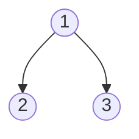
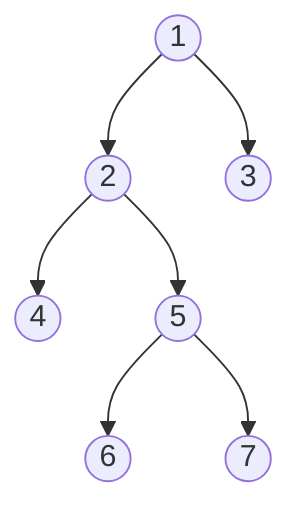
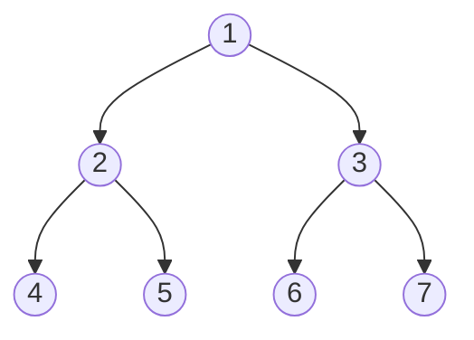
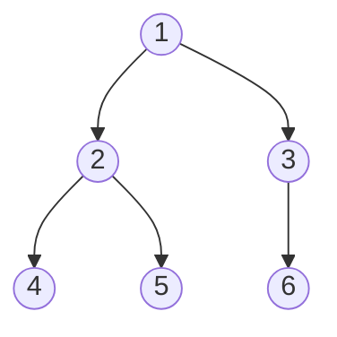
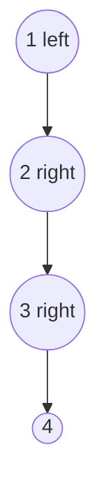
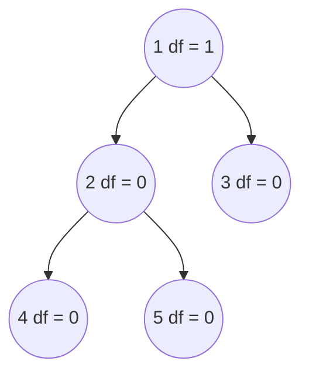

A binary tree is a tree data structure in which each parent node can have at most two children. Each node of a binary tree consists of three items:
-   data item
-   address of left child
-   address of right child




## Type of binary tree
### 1. Full binary tree
A full binary tree is a special type of binary tree in which every parent node / internal node has either two or no children or no children.



```java
boolean isFullBinaryTree(Node node) {
	if (node == null) {
		return true;
	}

	if (node.left == null && node.right == null) {
		return true;
	}

	if (node.left != null && node.right != null) {
		return isFullBinaryTree(node.left) && isFullBinaryTree(node.right);
	}
	return false;
}
```


### 2. Perfect binary tree
A perfect binary tree is a type of binary tree in which every internal node has exactly two child nodes and all the leaf nodes are at the same level.


```java
class PerfectBinaryTree {

	static class Node {
	    int key;
	    Node left, right;
	}

	// Calculate the depth
	static int depth(Node node) {
	    int d = 0;
	    while (node != null) {
			d++;
			node = node.left;
		}
	    return d;
	}

	// Check if the tree is perfect binary tree
	static boolean is_perfect(Node root, int d, int level) {

	    // Check if the tree is empty
	    if (root == null)
			return true;

	    // If for children
		if (root.left == null && root.right == null)
			return (d == level + 1);

	    if (root.left == null || root.right == null)
			return false;

	    return is_perfect(root.left, d, level + 1) && is_perfect(root.right, d, level + 1);
	}

	// Wrapper function
	static boolean is_Perfect(Node root) {
	    int d = depth(root);
	    return is_perfect(root, d, 0);
	}
}
```

### 3. Complete binary tree
A complete binary tree is just a full binary tree, but with three major differences
1. Every level must be completely filled.
2. All the leaf elements must lean towards the left.
3. The last leaf element might not have a right sibling i.e. a complete binary tree doesn't have to be a full binary tree.


```java
class BinaryTree {
  Node root;

	// Count the number of nodes
	int countNumNodes(Node root) {
	    if (root == null)
	      return (0);
	    return (1 + countNumNodes(root.left) + countNumNodes(root.right));
	}

  // Check for complete binary tree
	boolean checkComplete(Node root, int index, int numberNodes) {

		// Check if the tree is empty
	    if (root == null)
			return true;

	    if (index >= numberNodes)
	      return false;

	    return (checkComplete(root.left, 2 * index + 1, numberNodes)
	        && checkComplete(root.right, 2 * index + 2, numberNodes));
	}
}
```


### 4. Degenerate or Pathological tree
A degenerate or pathological tree is the tree having a single child either left or right.




### 5. Skewed binary tree
A skewed binary tree is a degenerate / pathological tree in which the tree is either dominated by the left or right nodes. Thus, there are two types of skewed binary tree: **left-skewed binary tree** and **right-skewed binary tree**.

### 6. Balanced binary tree
It is a type of binary tree in which the difference between the height of the left and the right subtree for each node is either 0 or 1.




