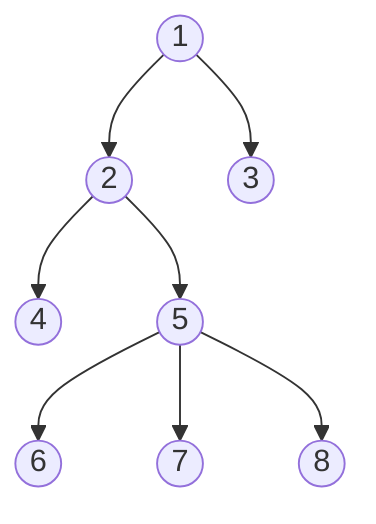
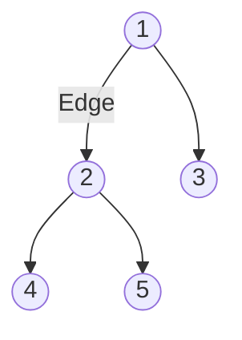
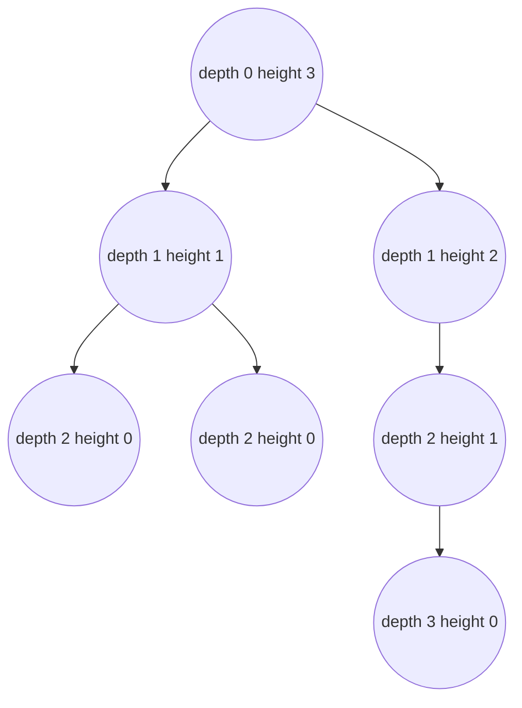

A tree is a nonlinear hierarchical data structure that consists of nodes connected by edges.

### Why tree data structure?
Other data structure such as arrays, linked list, stack, and queue are linear data structures. In order to perform any operation in a linear data structure, the time complexity increases with the increase in the data size. But, it is not acceptable in today's computational world.
Different tree data structures allow quicker and easier access to the data as it is a non-linear data structure.

### Tree terminologies
#### Node
A node is an entity that contains a key or value and pointers to its child nodes. The last nodes of each path are called **leaf nodes or external nodes** that do not contain a link / pointer to child nodes.
The node having at least a child node is called an **internal node**.

#### Edge
It is the link between any two nodes.

#### Root
The root is the topmost node of a tree.

#### Properties
- The **depth** of a node is the number of edges from the node to the tree's root node. The root node will have a height of 0.
- The **height** of a node is the number of edges on the *longest path* from the node to a leaf. A leaf node will have a height of 0.
- The **diameter (or width)** of a tree is the number of nodes on the longest path between any two leaf nodes.

