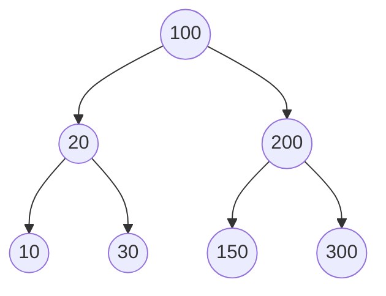

Traversing a tree means visiting every node in the tree. You might, for instance, want to add all the values in the tree or find the largest one. For all these operations, you will need to visit each node of the tree.

Linear data structures like arrays, stacks, queues, and linked list have only one way to read the data. But a hierarchical data structure like a tree can be traversed in different ways.



Reading the elements of the in tree above.
Starting from top, Left to right
`100 -> 20 -> 10 -> 30 -> 200 -> 150 -> 300`

Starting from the bottom, Left to right
`10 -> 30 -> 20 -> 150 -> 300 -> 200 -> 100`

Although this process is somewhat easy, it doesn't respect the hierarchy of the tree, only the depth of the nodes.
Instead, we use traversal methods that take into account the basic structure of a tree
```c
struct node {
	int data;
	struct node* left;
	struct node* right;
}
```

The struct node pointed to by *left* and *right* might have other left and right children, so we should think of them as sub-trees instead of sub-nodes.
According to this structure, every tree is a combination of
- A node carrying data
- Two sub-trees

Our goal is to visit each node, so we need to visit all the nodes in the left sub-tree, visit the root node and visit all the nodes in the right sub-tree as well.
Depending on the order in which we do this, there can be three types of traversal.

#### Inorder traversal
1. First, visit all the nodes in the left sub-tree.
2. Then the root node.
3. Visit all the nodes in the right sub-tree.

```c
inorder(root->left);
display(root->data);
inorder(root->right);
```

Output: `10 20 30 100 150 200 300`

#### Preorder traversal
1. Visit root node.
2. Visit all the nodes in the left sub-tree.
3. Visit all the nodes in the right sub-tree.

```c
display(root->data);
preorder(root->left);
preorder(root->right);
```

Output: `100 20 10 30 200 150 300`

#### Postorder traversal
1. Visit all the nodes in the left sub-tree.
2. Visit all the nodes in the right sub-tree.
3. Visit the root node.

```c
postorder(root->left);
postorder(root->right);
display(root->data);
```

Output: `10 30 20 150 300 200 100`